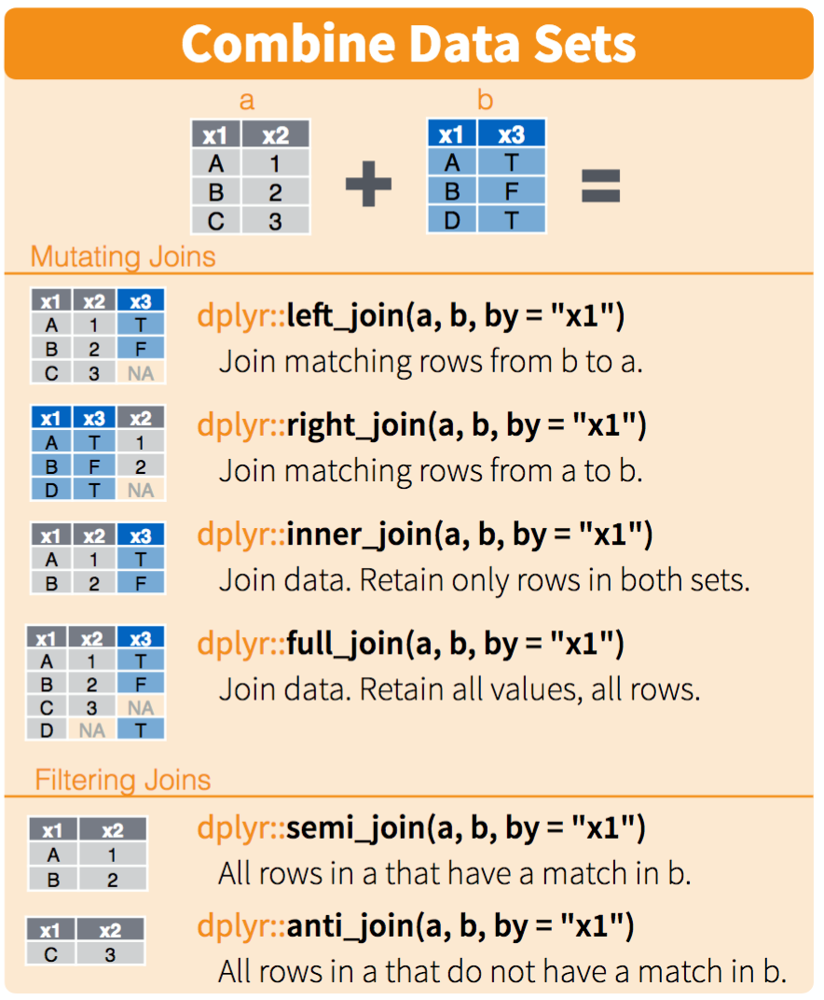

```{r}
library(tidyverse) # after install.packages("tidyverse")
```

```{r}
gap_wide <- read_csv("https://raw.githubusercontent.com/OHI-Science/data-science-training/master/data/gapminder_wide.csv")
```

Go from wide to long format of data frame. Separate text using underscore (_) (similar to text to columns) and re-name newly separated columns. The convert argument allows year to be categories as <numeric> rather than as a character <chr>
```{r}
gap_better <- gap_wide %>%
  gather(observation, observ_value, -continent, -country) %>%
  separate(observation, into = c("obs_type", "year"), sep = "_", convert = TRUE) 
```
But we now have 3 observation types in same column. We want to use spread to separate them into 3 different columns (goal: one data type per column)
```{r}
unique(gap_better$obs_type) # see what types are in the obs_type column
```
```{r}
gap_better %>%
  spread(obs_type, observ_value) # need column name and associated value
```
Insert image into R markdown

